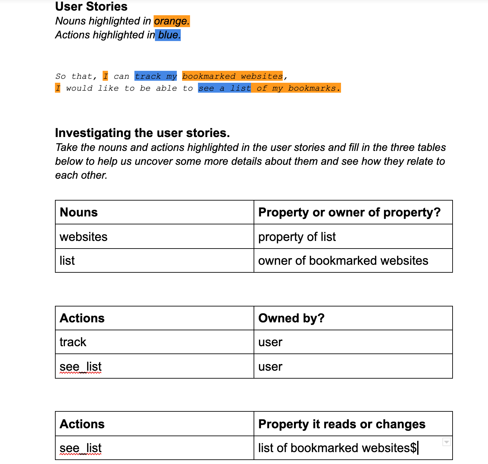

## Challenge 1: 
------

The requirement: 
- Show a list of bookmarks

- User story generated: 

```
As a user who browse through internet, 
So that, I can track and use my bookmarked websites,
I would like to be able to see a list of my bookmarks.
```
- Domain model generated: 




----
## Challenge 5 and  9: 

For this challenge, we were required to set up a new database. The project now includes depostiory and sub-depository: `db/migration` in which a new `sql` databes to be created is written up. However, for it to be subale you will have to first: 

1. Instsall PostgreSQL (for Mac) by running homebrew in your command line: `$ brew install postgresql`
2. Starting the `psql` services by: `$ brew services start postgresql`
3. creating a database for the project by: `CREATE DATABASE bookmark_manager;` in `psql` and a test database by: `CREATE DATABASE "bookmark_manager_test";`
4. Connect to database with `psql` by: `\c bookmark_manager;`
5. Finally, run `01_create_bookmarks_table.sql` in `db/migration` and `02_create_bookmarks_table_test.sql` in `bookmark_manager_test`.

---
## Challenge 10

- User story 

```
As a user 
So I can have multiple bookmarks
I'd like to be able of add new bookmarks

```